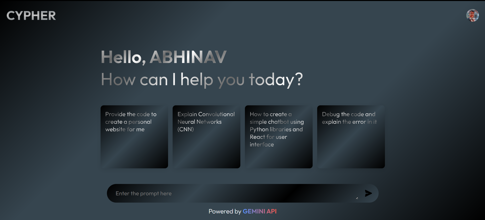

# Cypher - AI Chatbot


Cypher is an AI-powered chatbot designed to assist users with various programming tasks and inquiries. Leveraging advanced natural language processing models and a sleek React-based user interface, Cypher aims to provide a seamless and interactive experience for developers.

## Screenshots


## Features

- **Language Processing**: Utilizes Hugging Face Transformers for robust language understanding and response generation.
- **User Interface**: Built with React, featuring an intuitive design with Ant Design components.
- **Markdown Support**: Supports Markdown rendering for code snippets and formatted text.
- **Syntax Highlighting**: Uses Prism.js for syntax highlighting in code snippets.
- **Firebase Authentication**: Implements Google Sign-In for user authentication.
- **Responsive Design**: Ensures a seamless experience across different devices.

## Technologies Used

### Backend

- **API'S and LANGUAGES**:
  - [GEMINI-API](https://ai.google.dev/aistudio)
  - [Firebase](https://firebase.google.com)

### Frontend

- **React Libraries**:
  - [Create React App](https://create-react-app.dev/)
  - [Ant Design](https://ant.design/)
  - [React Markdown](https://github.com/remarkjs/react-markdown)
  - [Prism.js](https://prismjs.com/)

## Getting Started

### Prerequisites

- Node.js and npm installed
- Python 3.7+
- Firebase project setup

### Installation

1. **Clone the repository**:
    ```bash
    git clone https://github.com/abhinav-123457/CYPHER.git
    cd cypher
    ```

2. **Backend Setup**:
    - Navigate to the backend directory and install the required Python packages:
        ```bash
        pip install -r requirements.txt
        ```

3. **Frontend Setup**:
    - Navigate to the frontend directory and install the dependencies:
        ```bash
        npm install
        ```
        
4. **Firebase Setup**:
    - Configure Firebase in your React project by setting up your Firebase project and updating the Firebase config file.
        ```bash
        apiKey: "Your_Firebase_Api_key",
        authDomain: "Your_Firebase_auth_Domain",
        projectId: "Your_Firebase_Project_ID",
        storageBucket: "Your_Firebase_Storage_bucket",
        messagingSenderId: "Your_Firebase_Message_Sender_ID",
        appId:"Your_Firebase_AppID
        ```
5. **Gemini API**:
    - Go to google ai studio and configure your gemini api key and updating the Gemini.js file.
        ```bash
        const API_KEY = "Your_Gemini_API-KEY"
        ```
### Running the Application

1. **Start the Frontend**:
    ```bash
    npm start
    ```

## Usage

1. Sign in using Google authentication.
2. Interact with Cypher by typing your queries in the input box.
3. Receive responses with code snippets, explanations, and more.

## Project Structure
```bash
CHATBOT/
└── 📁public
    └── cypher.jpg
    └── index.html
    └── manifest.json
    └── robots.txt
└── 📁src
    └── App.js
    └── App.test.js
    └── chatbot.jsx
    └── 📁Componets
        └── 📁main
            └── main.css
            └── Main.jsx
            └── send.png
    └── 📁config
        └── Gemini.js
    └── 📁context
        └── Context.jsx
    └── cypher.jpg
    └── 📁Features
        └── Features.css
        └── Features.js
    └── 📁FIrebase
        └── firebaseConfig.js
        └── useAuth.js
    └── index.css
    └── index.js
    └── reportWebVitals.js
    └── setupTests.js
    └── 📁Signin
        └── SignIn.css
        └── SignIn.js
```

## Contributing

Contributions are welcome! Please fork this repository and submit pull requests with any improvements or new features.

## License

This project is licensed under the MIT License - see the [LICENSE](LICENSE) file for details.


## Contact

For any inquiries or support, please reach out to [abhinavshakya063@gmail.com](mailto:abhinavshakya063@gmail.com).

---

**Cypher** - Your AI-powered programming assistant.

